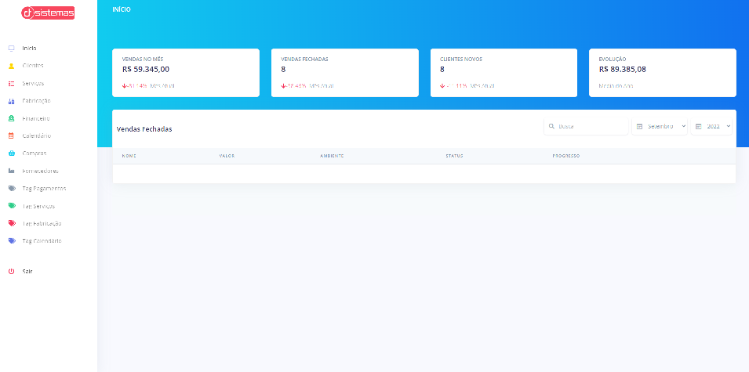

# 🚀 CRM Sistema

Este sistema tem como objetivo solucionar problemas empresariais, como organizar clientes, serviços toda area financeira.

# 🧠 Contexto

Funcionalidades:
- [ ] Calendario
- [ ] Adicionar, editar e remover (clientes, servicos, produção, calendario, financeiro)
- [ ] Busca com filtros

## 📋 Tecnologias

- Frontend React.js

- Backend Node.js

- PostgresSql

## ✏️ Feito por Diogo Travalha

